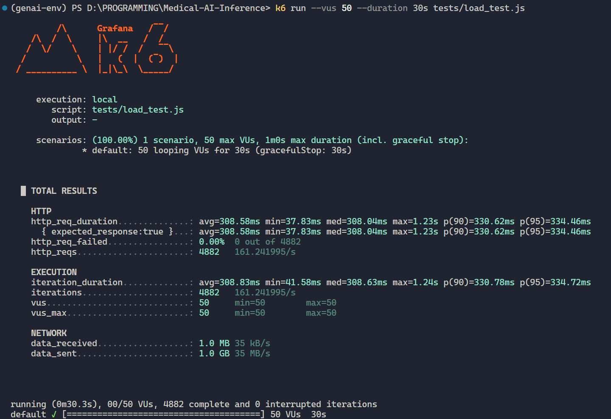
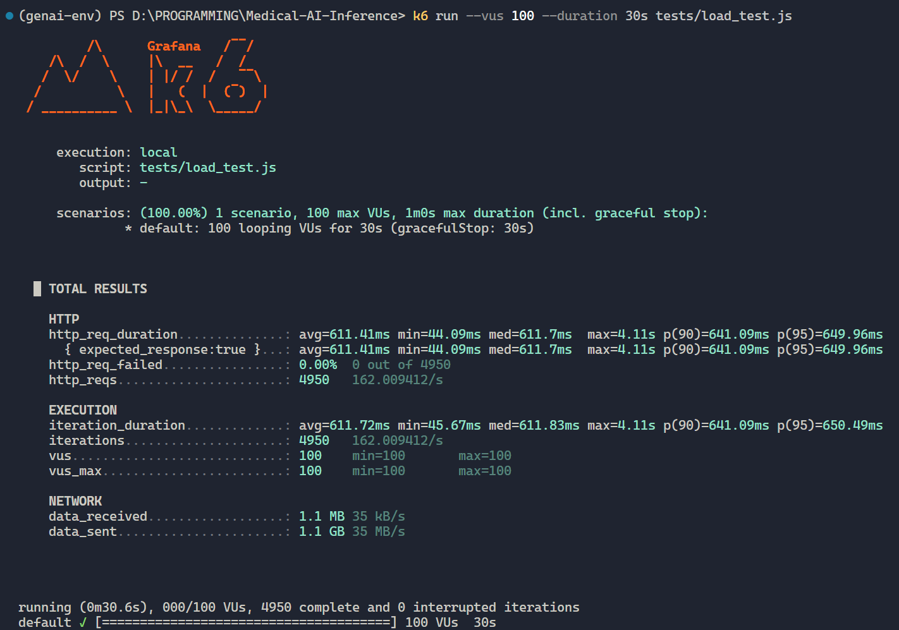
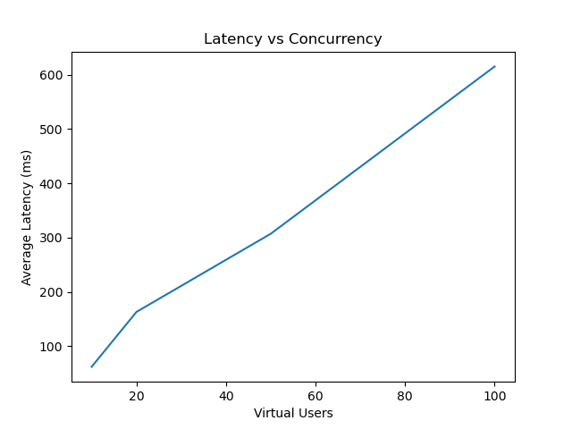
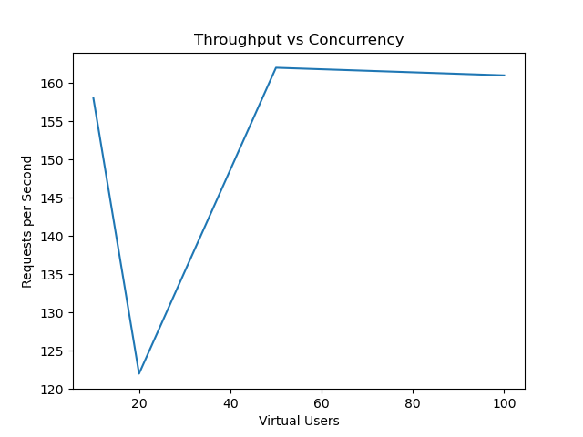

# Medical AI Inference System

Production-oriented inference stack for **4-class medical image classification** using **ResNet50 + NVIDIA Triton + FastAPI**, containerized with Docker Compose and validated with k6 load testing.

---

## Table of Contents

- [Project Overview](#project-overview)
- [Why This Project Matters](#why-this-project-matters)
- [System Architecture](#system-architecture)
- [Architecture Diagram (ASCII)](#architecture-diagram-ascii)
- [Technology Stack](#technology-stack)
- [Model Details](#model-details)
- [Model Serving with Triton](#model-serving-with-triton)
- [API Design](#api-design)
- [Performance & Load Testing](#performance--load-testing)
- [Worker Optimization Study](#worker-optimization-study)
- [Throughput Plateau Analysis](#throughput-plateau-analysis)
- [Cold Start Behavior](#cold-start-behavior)
- [Scalability Strategy](#scalability-strategy)
- [Deployment Instructions (Step-by-step)](#deployment-instructions-step-by-step)
- [Hardware Specifications](#hardware-specifications)
- [Key Engineering Decisions](#key-engineering-decisions)
- [Future Improvements](#future-improvements)
- [License](#license)

---

## Project Overview

This repository demonstrates a practical, production-style ML inference system for medical image classification. The service accepts an image upload, runs preprocessing in FastAPI, sends tensors to NVIDIA Triton for GPU inference, then returns a predicted class with confidence and request latency.

Core objectives:

- Serve a deep learning model behind a stable HTTP API.
- Separate API responsibilities from inference execution.
- Use GPU acceleration and dynamic batching for throughput.
- Measure behavior under concurrent load and identify limits.

---

## Why This Project Matters

Many ML projects stop at model training and do not show how to deploy or operate inference systems under realistic traffic. This project focuses on the serving side:

- **For ML engineers:** demonstrates ONNX export and Triton deployment.
- **For backend engineers:** demonstrates API boundary design, validation flow, and latency tracking.
- **For DevOps/platform engineers:** demonstrates containerized GPU services and scaling boundaries.
- **For hiring managers/recruiters:** shows end-to-end execution from model packaging to load-tested API delivery.

---

## System Architecture

The system intentionally splits responsibilities:

- **FastAPI layer (`app/`)**
  - Handles multipart uploads (`/predict`) and health checks (`/health`).
  - Runs image preprocessing and result postprocessing.
  - Measures end-to-end per-request latency.
  - Exposes Prometheus metrics endpoint via instrumentation.
- **Triton Inference Server (`model_repository/`)**
  - Hosts ONNX model with GPU instance group.
  - Handles inference requests over HTTP.
  - Applies dynamic batching policy for better GPU efficiency.
- **Docker Compose (`docker-compose.yml`)**
  - Boots API and Triton as isolated services.
  - Mounts model repository into Triton.
  - Exposes service ports for inference and observability.

Request lifecycle:

1. Client sends an image to `POST /predict`.
2. FastAPI preprocesses image to normalized NCHW FP32 tensor.
3. API sends tensor to Triton model `resnet_medical`.
4. Triton returns logits.
5. API computes softmax-like confidence, maps class label, and returns JSON response.

---

## Architecture Diagram (ASCII)

```text
                        +------------------------------+
                        |          Client(s)           |
                        |  (web app, script, k6 load) |
                        +--------------+---------------+
                                       |
                                       | HTTP multipart/form-data
                                       v
+-----------------------------------------------------------------------+
|                          FastAPI Service (API)                         |
|------------------------------------------------------------------------|
| /predict: parse upload -> preprocess -> Triton call -> postprocess     |
| /health : liveness check                                                |
| /metrics: Prometheus instrumentation                                   |
+-------------------------------+----------------------------------------+
                                |
                                | HTTP infer request (FP32 tensor)
                                v
+-----------------------------------------------------------------------+
|                    NVIDIA Triton Inference Server                      |
|------------------------------------------------------------------------|
| Model: resnet_medical (ONNX Runtime backend)                           |
| Dynamic batching: preferred [4, 8, 16], queue delay 1000us            |
| Instance group: GPU                                                     |
+-------------------------------+----------------------------------------+
                                |
                                v
                         +--------------+
                         | RTX 4060 GPU |
                         +--------------+
```

---

## Technology Stack

| Layer               | Technology                        | Purpose                                            |
| ------------------- | --------------------------------- | -------------------------------------------------- |
| API                 | FastAPI + Uvicorn                 | Async HTTP serving and worker concurrency          |
| Inference           | NVIDIA Triton Inference Server    | High-performance model serving                     |
| Model Runtime       | ONNX Runtime (Triton backend)     | Executes ONNX graph on GPU                         |
| Model               | ResNet50 (4-class head)           | Medical image classification                       |
| Containerization    | Docker + Docker Compose           | Reproducible multi-service deployment              |
| Performance Testing | k6                                | Load generation and latency/throughput measurement |
| Monitoring          | Prometheus FastAPI Instrumentator | `/metrics` endpoint exposure                       |

---

## Model Details

- **Base architecture:** ResNet50
- **Task type:** Multi-class image classification
- **Output classes (4):**
  - Glioma
  - Meningioma
  - Pituitary
  - No Tumor
- **Input tensor shape:** `[batch, 3, 224, 224]` (FP32)
- **Preprocessing pipeline:** RGB conversion, resize to `224x224`, normalization to `[0,1]`, channel-first transform
- **Export format:** ONNX (`opset_version=17`) with dynamic batch axis

The model export script (`export_model.py`) configures the final classification head for 4 classes and exports an ONNX artifact for Triton consumption.

---

## Model Serving with Triton

Triton model configuration (`model_repository/resnet_medical/config.pbtxt`):

- `name: "resnet_medical"`
- `platform: "onnxruntime_onnx"`
- `max_batch_size: 16`
- Input: `TYPE_FP32`, shape `[3, 224, 224]`
- Output: `TYPE_FP32`, shape `[4]`
- `instance_group`: `KIND_GPU`
- Dynamic batching:
  - `preferred_batch_size: [4, 8, 16]`
  - `max_queue_delay_microseconds: 1000`

### Why this config is useful

- **Dynamic batching** combines incoming requests into larger GPU-friendly batches when timing allows.
- **Queue delay cap (1000µs)** avoids unbounded waiting and protects latency.
- **GPU instance group** ensures inference executes on CUDA hardware.
- **Batch size cap (16)** sets a practical upper limit aligned with memory and latency trade-offs.

---

## API Design

### Endpoints

| Method | Path       | Description                                                         |
| ------ | ---------- | ------------------------------------------------------------------- |
| `POST` | `/predict` | Accepts an uploaded image and returns prediction/confidence/latency |
| `GET`  | `/health`  | Health probe endpoint                                               |
| `GET`  | `/metrics` | Prometheus metrics exposed by instrumentation                       |

### Sample Request

```bash
curl -X POST "http://localhost:8002/predict" \
  -H "accept: application/json" \
  -H "Content-Type: multipart/form-data" \
  -F "image=@tests/test.jpg"
```

### Sample Response

```json
{
  "prediction": "Glioma",
  "confidence": 0.93,
  "latency_ms": 11.7
}
```

> Notes:
>
> - Exact class and confidence depend on input image and model state.
> - `latency_ms` is computed at API level and includes preprocessing + Triton request + postprocessing.

---

## Performance & Load Testing

Load testing was executed with k6 for **30 seconds** across concurrency levels.

| Virtual Users | Avg Latency |   P95 | Throughput (RPS) | Failures |
| ------------: | ----------: | ----: | ---------------: | -------: |
|            10 |        62ms |  80ms |          158 rps |       0% |
|            20 |       163ms | 134ms |          122 rps |       0% |
|            50 |       307ms | 334ms |          162 rps |       0% |
|           100 |       615ms | 641ms |          161 rps |       0% |

### k6 command example

```bash
k6 run --vus 50 --duration 30s tests/load_test.js
```

Observations:

- Stable operation through 100 concurrent users.
- No failed requests in the provided test runs.
- Throughput plateaus around ~160 RPS.
- Latency grows as request pressure exceeds optimal processing capacity.

---

## Load Test Output (k6)

### 50 Virtual Users



### 100 Virtual Users



---

## Worker Optimization Study

Uvicorn worker counts were compared for API throughput impact.

| Workers | Observed Outcome       |
| ------: | ---------------------- |
|       4 | Best result (~160 rps) |
|       6 | No improvement         |
|       8 | Slight degradation     |

Interpretation:

- Increasing workers beyond 4 added scheduling/context-switch overhead.
- Optimal worker count depended on CPU characteristics and API workload, not just raw core count.

---

## Throughput Plateau Analysis

Observed throughput ceiling: **~160 requests/sec**.

At higher load:

- Throughput remains mostly flat.
- Latency continues to increase.
- Failures stay at 0% in tested scenarios.

Likely bottleneck in current setup:

- API layer and request handling overhead appear to saturate before GPU inference becomes the dominant limit.

This is consistent with a system where model execution is efficient, but ingress, serialization, and per-request CPU work cap end-to-end throughput.

---

## Performance Graphs

### Latency vs Concurrency



### Throughput vs Concurrency



---

## Cold Start Behavior

First inference request latency was significantly higher (**~2.6s**), while warm requests stabilized around **7–14ms**.

Expected causes:

- CUDA context initialization
- ONNX Runtime kernel loading
- Initial GPU memory allocation

Production mitigation options:

- Send warm-up requests after deployment.
- Keep service warm with periodic probes.
- Hide startup readiness behind orchestration health gates.

---

## Scalability Strategy

The architecture supports incremental scaling at multiple layers:

- **API horizontal scaling**
  - Replicate FastAPI instances behind a load balancer.
  - Keep stateless request handlers for easy scale-out.
- **Inference scaling**
  - Deploy Triton per GPU and route traffic by model/service.
  - Tune dynamic batching parameters for target latency SLOs.
- **Orchestration migration path**
  - Move from Docker Compose to Kubernetes for autoscaling, rolling updates, and richer observability.
- **Operational scaling**
  - Separate API and Triton resource limits to avoid noisy-neighbor contention.

---

## Deployment Instructions (Step-by-step)

### 1) Prerequisites

- Docker Engine + Docker Compose
- NVIDIA GPU + compatible NVIDIA driver
- NVIDIA Container Toolkit (for GPU access inside containers)

### 2) Clone and enter repository

```bash
git clone <your-repo-url>
cd Medical-AI-Inference
```

### 3) (Optional) Local Python environment for tooling/tests

```bash
python -m venv .venv
source .venv/bin/activate  # Linux/macOS
pip install -r requirements.txt
```

### 4) Start services with Docker Compose

```bash
docker compose up --build
```

This launches:

- `triton` on `8000` (HTTP infer) and `8001` (gRPC)
- `api` on `8002`

### 5) Verify health

```bash
curl http://localhost:8002/health
```

### 6) Run a prediction request

```bash
curl -X POST "http://localhost:8002/predict" -F "image=@tests/test.jpg"
```

### 7) Run load test

```bash
k6 run --vus 50 --duration 30s tests/load_test.js
```

### Docker Compose design notes

- `triton` mounts `./model_repository:/models` and starts with `--model-repository=/models`.
- `api` depends on `triton` and forwards inference requests to `triton:8000`.
- GPU device reservation is declared in compose for Triton service.

---

## Hardware Specifications

Benchmark environment:

- **CPU:** 16 Cores / 24 Logical Processors
- **GPU:** NVIDIA RTX 4060 Laptop GPU (8GB VRAM)
- **RAM:** 16GB DDR5
- **OS:** Windows 11 + Docker (WSL2 backend)

---

## Key Engineering Decisions

1. **Separated API and inference server**
   - FastAPI handles HTTP concerns; Triton specializes in model execution.
2. **ONNX + Triton runtime**
   - Standardized model artifact and production inference runtime decoupling.
3. **Dynamic batching enabled**
   - Better GPU utilization under concurrent traffic without rewriting API logic.
4. **Multi-worker API process model**
   - Tuned worker count empirically for best observed throughput.
5. **Container-first deployment**
   - Reproducible setup and clear path to orchestrated environments.
6. **Load-test-driven analysis**
   - Performance claims are backed by measured runs instead of assumptions.

---

## Future Improvements

- Add versioned model management and canary rollout strategy.
- Add request authentication and rate limiting.
- Add structured tracing (OpenTelemetry) across API ↔ Triton boundaries.
- Add automated CI benchmarks and regression thresholds.
- Expand monitoring dashboards (latency percentiles, GPU utilization, queue depth).
- Introduce Kubernetes deployment manifests/Helm charts for production rollout.

## Submission Notes

- This project focuses on scalable model serving and inference infrastructure.
- Model training is intentionally out of scope.
- Performance metrics were gathered on a single-node GPU-enabled environment.
- Throughput and latency characteristics are documented based on empirical load testing.
